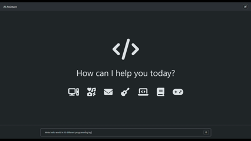

# AI Assistant UI

A sleek and responsive front-end chat interface for Google's Gemini API, built with HTML, CSS, and jQuery. This project provides a user-friendly platform to interact with the AI, featuring real-time responses, Markdown rendering, and code highlighting.

### Demo: [Assistant](https://assistant-yp1q.onrender.com/)

---

## Features

-   **Direct Gemini API Integration:** Fetches and processes results directly from the Gemini API.
-   **Markdown Support:** Responses are properly formatted with support for headings, lists, bold, italics, and links.
-   **Code Block Formatting:** Code snippets in the AI's response are automatically highlighted with a "Copy Code" button.
-   **New Chat Functionality:** Easily clear the current conversation and start a new one.
-   **Responsive Design:** A clean, modern UI that works seamlessly on both desktop and mobile devices.

---

## Technologies Used

-   **Markup:** HTML5
-   **Styling:** CSS3
-   **Logic:** JavaScript & jQuery
-   **API:** Google Gemini API

---
